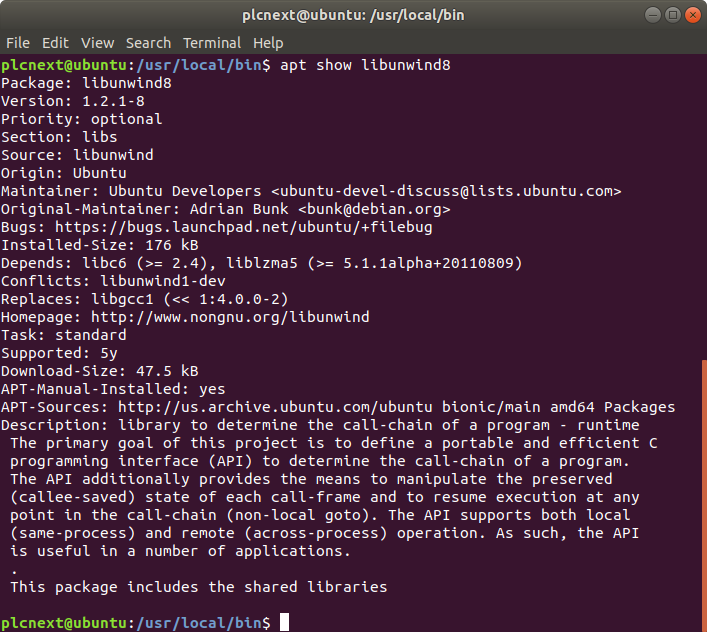
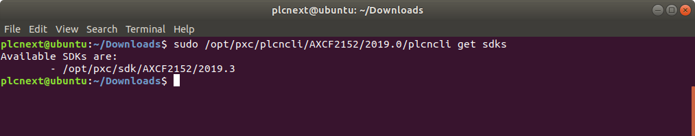

# How to install "**PLCnext 2019.3**" on Ubuntu 18.04 LTS #
## 1. Install **Eclipse®** IDE ##

1. Check whether **JRE** is already installed or not. The latest **Java SE** is recommended:

```sh
java -version
```


If not installed, install **OpenJdk**:

```sh
sudo apt-get install openjdk-11-jre
```

Afterwards, the check should look like this:


2. To install **Eclipse IDE for C/C++ Developers** visit https://www.eclipse.org/downloads/packages/, select and download appropriate package:


or use wget to download **2019.3 R** version (risk of being changed):

```sh
wget -P ~/Downloads http://ftp.snt.utwente.nl/pub/software/eclipse//technology/epp/downloads/release/2019-03/R/eclipse-cpp-2019-03-R-linux-gtk-x86_64.tar.gz
```

Extract the „eclipse-cpp-2019-03-R-linux-gtk-x86_64.tar.gz“:

```sh
cd ~/Downloads
tar -xzf eclipse-cpp-2019-03-R-linux-gtk-x86_64.tar.gz
```

Move extracted folder to */opt*:

```sh
sudo mv eclipse /opt/
```

Create a desktop file in */usr/share/applications*:

```sh
sudo nano /usr/share/applications/eclipse.desktop
```
Copy following content into desktop file:

```sh
[Desktop Entry]
Name=Eclipse
Type=Application
Exec=/opt/eclipse/eclipse
Terminal=false
Icon=/opt/eclipse/icon.xpm
Comment=Integrated Development Environment
NoDisplay=false
Categories=Development;IDE
Name[en]=eclipse.desktop
```

Create a symlink in */usr/local/bin*:

```sh
cd /usr/local/bin
sudo ln -s /opt/eclipse/eclipse
```

**Eclipse** is now ready to use.

## 2. Install **Libunwind** library ##

Check installation:

```sh
apt show libunwind8
```


If not installed, install **Libunwind**:

```sh
sudo apt-get install libunwind8
```

## 3. Install PLCnext Technology C++ Toolchain ##

### 3.1 Prerequisites ###

Install **CMake**:

```sh
sudo apt-get install cmake
```

### 3.2 Toolchain ###

Visit **AXC F 2152** software [site](https://www.phoenixcontact.com/online/portal/pi?uri=pxc-oc-itemdetail:pid=2404267&library=piru&tab=5&requestType=qr&productId=2404267#software) and download toolchain (PLCnext Technology Command Line Interface - PLCnCLI **2019.0** - and software development kit - SDK **2019.3**).

Unzip **PLCnCLI**:

```sh
cd ~/Downloads
unzip PLCnCLI_Linux64_2019.0.zip
```

Unzip **SDK**:

```sh
unzip SDK_Linux64_2019.3.zip
```

Install **PLCnCLI** and move it to */opt/pxc/plcncli/AXCF2152/2019.0*:

```sh
sudo plcncli install sdk -p 
sudo mkdir -p /opt/pxc/plcncli/AXCF2152/2019.0
sudo mv ./plcncli/* /opt/pxc/plcncli/AXCF2152/2019.0
```
To simplify calling the file in the console create symbolic link:

```sh
ln -s /opt/pxc/plcncli/AXCF2152/2019.0/plcncli /usr/local/bin/plcncli
```

Install **SDK**:

```sh
chmod +x ./pxc-glibc-x86_64-axcf2152-image-sdk-cortexa9t2hf-neon-toolchain-2019.3.sh
sudo plcncli install sdk -p pxc-glibc-x86_64-axcf2152-image-sdk-cortexa9t2hf-neon-toolchain-2019.3.sh -d /opt/pxc/sdk/AXCF2152/2019.3
```

Check **SDK**:

```sh
sudo /opt/pxc/plcncli/AXCF2152/2019.0/plcncli get sdks
```



## 4. Configure **Eclipse®** IDE to develop without using **PLCnCLI** ##

Set project cross settings (prefix and path):

>arm-pxc-linux-gnueabi-  
>/opt/pxc/sdk/AXCF2152/2019.3/sysroots/x86_64-pokysdk-linux/usr/bin/arm-pxc-linux-gnueabi


Set project cross G++ Compiler dialect settings:

>-march=armv7-a -mthumb -mfpu=neon -mfloat-abi=hard -mcpu=cortex-a9 --sysroot=/opt/pxc/sdk/AXCF2152/2019.3/sysroots/cortexa9t2hf-neon-pxc-linux-gnueabi -fno-gnu-unique


Set project cross G++ Preprocessor defines:

>-ARP_DEVICE_AXCF2152


Set project cross G++ Preprocessor includes:

>/opt/pxc/sdk/AXCF2152/2019.3/sysroots/cortexa9t2hf-neon-pxc-linux-gnueabi/usr/include/plcnext


Set project cross G++ Linker flags:

>--sysroot=/opt/pxc/sdk/AXCF2152/2019.3/sysroots/cortexa9t2hf-neon-pxc-linux-gnueabi -march=armv7-a -mthumb -mfpu=neon -mfloat-abi=hard -mcpu=cortex-a9 -Wl,--no-undefined


