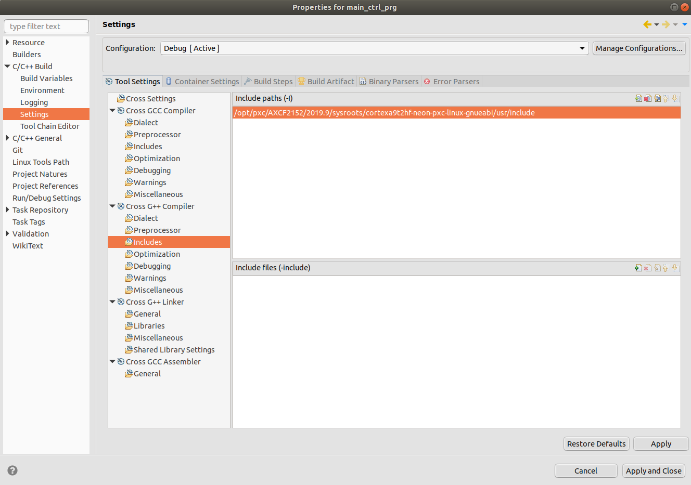

# How to configure Eclipse® to program and crosscompile for the AXC F 2152 on Ubuntu 18.04 LTS #

> This HowTo only works for the AXC F 2152 firmware version 2020.0. For other devices or FW versions the build flags are different and could change from version to version.

## 1. Install **Eclipse®** IDE ##

1. Check whether **JRE** is already installed or not. The latest **Java SE** is recommended:

```sh
java -version
```


If not installed, install **OpenJdk**:

```sh
sudo apt-get install openjdk-11-jre
```

Afterwards, the check should look like this:


2. To install **Eclipse IDE for C/C++ Developers** visit https://www.eclipse.org/downloads/packages/, select and download appropriate package:


or use wget to download **2020‑03 R** version (risk of being changed):

```sh
wget -P ~/Downloads http://http://ftp.snt.utwente.nl/pub/software/eclipse/technology/epp/downloads/release/2020-03/R/eclipse-cpp-2020-03-R-incubation-linux-gtk-x86_64.tar.gz
```
Make sure you download the correct package and the download was successful.

Extract the „eclipse-cpp-2020-0-R-linux-gtk-x86_64.tar.gz“:

```sh
cd ~/Downloads
tar -xzf eclipse-cpp-2020-0-R-linux-gtk-x86_64.tar.gz
```

Create a desktop launcher for Eclipse:

```sh
sudo nano /usr/share/applications/eclipse.desktop
```

Copy the following into the desktop file:

```sh
[Desktop Entry]
Name=Eclipse
Type=Application
Exec=/opt/eclipse/eclipse
Terminal=false
Icon=/opt/eclipse/icon.xpm
Comment=Integrated Development Environment
NoDisplay=false
Categories=Development;IDE
Name[en]=eclipse.desktop
```

Create a symlink to make eclipse available from the console:

```sh
cd /usr/local/bin
sudo ln -s /opt/eclipse/eclipse
```

**Eclipse** is now ready to use.

## 3. Install the Toolchain ##

The SDK contains all components (libraries and toolchains) to create a C++ application for
PLCnext Technology.

Unzip **SDK**:

Download the needed SDK from the Phoenix Contact webside.

[LINK](http://www.phoenixcontact.com/qr/2404267/softw)

Navigate to the folder where your SDK is located.

```sh
unzip SDK_Linux64_2020.0.zip
```

**Note**:
Avoid spaces in the SDK directory.

**Note**:
The archive is always extracted in the same directory.

Install **SDK**:

```sh
chmod +x ./pxc-glibc-x86_64-axcf2152-image-sdk-cortexa9t2hf-neon-toolchain-2020.0.sh
./pxc-glibc-x86_64-axcf2152-image-sdk-cortexa9t2hf-neon-toolchain-2020..sh
```
Specify the path to install:

>/opt/pxc/sdk/AXCF2152/2020.0

**Note**:
Several PLCnext Technology SDKs can be used in parallel. To prevent a mix of different
versions, Phoenix Contact recommends removing all older SDKs.

## 4. Configure Eclipse® IDE to use the installed PLCnext SDK ##

Set project cross settings (prefix and path):

>arm-pxc-linux-gnueabi-  
>/opt/pxc/sdk/AXCF2152/2020.0/sysroots/x86_64-pokysdk-linux/usr/bin/arm-pxc-linux-gnueabi


Set project cross G++ Compiler dialect settings:

>-march=armv7-a -mthumb -mfpu=neon -mfloat-abi=hard -mcpu=cortex-a9 --sysroot=/opt/pxc/sdk/AXCF2152/2020.0/sysroots/cortexa9t2hf-neon-pxc-linux-gnueabi -fno-gnu-unique


Set project cross G++ Preprocessor defines:

>ARP_DEVICE_AXCF2152


Set project cross G++ Preprocessor includes:

>/opt/pxc/sdk/AXCF2152/2020.0/sysroots/cortexa9t2hf-neon-pxc-linux-gnueabi/usr/include/plcnext



Set project cross G++ Linker flags:

>--sysroot=/opt/pxc/sdk/AXCF2152/2020.0/sysroots/cortexa9t2hf-neon-pxc-linux-gnueabi -march=armv7-a -mthumb -mfpu=neon -mfloat-abi=hard -mcpu=cortex-a9 -Wl,--no-undefined


After completing all the settings, run the project and, if there are errors, you need to go through all the previous steps and check the spelling of the commands.
