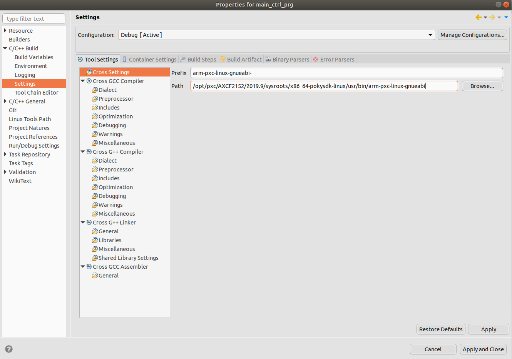
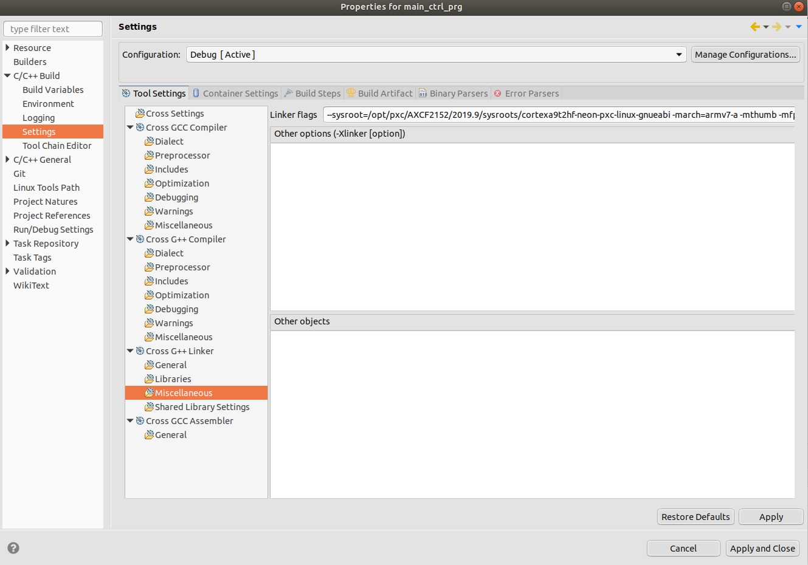

# How to configure Eclipse® to program and crosscompile for the AXC F 2152 on Ubuntu 18.04 LTS #

> This HowTo only works for the AXC F 2152 firmware version 2019.9. For other devices or FW versions the build flags are different and could change from version to version.

## 1. Install **Eclipse®** IDE ##

1. Check whether **JRE** is already installed or not. The latest **Java SE** is recommended:

```sh
java -version
```


If not installed, install **OpenJdk**:

```sh
sudo apt-get install openjdk-11-jre
```

Afterwards, the check should look like this:


2. To install **Eclipse IDE for C/C++ Developers** visit https://www.eclipse.org/downloads/packages/, select and download appropriate package:


or use wget to download **2019.9 R** version (risk of being changed):

```sh
wget -P ~/Downloads http://ftp.snt.utwente.nl/pub/software/eclipse//technology/epp/downloads/release/2019-09/R/eclipse-cpp-2019-09-R-linux-gtk-x86_64.tar.gz
```

Make sure you download the correct package and the download was successful.

Extract the „eclipse-cpp-2019-09-R-linux-gtk-x86_64.tar.gz“:

```sh
cd ~/Downloads
tar -xzf eclipse-cpp-2019-09-R-linux-gtk-x86_64.tar.gz
```

> **Hint:** Move the extracted folder to */opt*. The **Opt**ional folder is typically for programs not installed via a packagemanager and in contrast to the home folder, it is accessable for any user on the system.
>
> \> sudo mv eclipse /opt/

Create a desktop launcher for Eclipse with the following content:

```sh
sudo gedit ~Desktop/eclipse.desktop
```

Copy the following into the desktop file:

```sh
[Desktop Entry]
Name=Eclipse
Type=Application
Exec=/opt/eclipse/eclipse
Terminal=false
Icon=/opt/eclipse/icon.xpm
Comment=Integrated Development Environment
NoDisplay=false
Categories=Development;IDE
Name[en]=eclipse.desktop
```

The shortcut must be executable. You can set this with the following command:

```sh
sudo  chmod 744 ~Desktop/eclipse.desktop
```

Create a symlink to make eclipse avaible from the console:

```sh
cd /usr/local/bin
sudo ln -s /opt/eclipse/eclipse
```

Use the following command to assign the Eclipse icon to the shortcut:

```sh
sudo cp /opt/eclipse/icon.xpm /usr/share/pixmaps/eclipse.xpm
```
Java is required to start Eclipse. It can be installed as a package

```sh
sudo apt-get install openjdk-8-jdk
```

CMake is required for compiling. It can also be installed as a package.

```sh
sudo apt-get install lib32ncurses5 lib32z1 libstdc++6:i386cmake
```

The directory "org.eclipse.osgi" is added once Eclipse is started.
It must be possible to modify this directory. Use the following command to make this setting

```sh
sudo chown -R $USER:$USER /opt/eclipse/configuration/org.eclipse.osgi
```

**Eclipse** is now ready to use and  can be started by way of the desktop shortcut. 

## 3. Install the Toolchain ##

Unzip **SDK**:

Download the needed SDK from the Phoenix Contact webside.

[LINK](http://www.phoenixcontact.com/qr/2404267/softw)

Navigate to the folder where your SDK is located.

```sh
unzip SDK_Linux64_2019.9.zip
```

Install **SDK**:

```sh
chmod +x ./pxc-glibc-x86_64-axcf2152-image-sdk-cortexa9t2hf-neon-toolchain-2019.9.sh
./pxc-glibc-x86_64-axcf2152-image-sdk-cortexa9t2hf-neon-toolchain-2019.9.sh
```

Specify the path to install:

```sh
>/opt/pxc/AXCF2152/2019.9
```

##Installing Mono-Complete ##

The Mono-Complete package is required for using the PLCnext Technology Library Builder.
It can be installed with the following command:

```sh
sudo apt-get install mono-complete
```

## 4. Configure Eclipse® IDE to use the installed PLCnext SDK ##

Set project cross settings (prefix and path):

>arm-pxc-linux-gnueabi-  
>/opt/pxc/AXCF2152/2019.9/sysroots/x86_64-pokysdk-linux/usr/bin/arm-pxc-linux-gnueabi



Set project cross G++ Compiler dialect settings:

>-march=armv7-a -mthumb -mfpu=neon -mfloat-abi=hard -mcpu=cortex-a9 --sysroot=/opt/pxc/AXCF2152/2019.9/sysroots/cortexa9t2hf-neon-pxc-linux-gnueabi -fno-gnu-unique


Set project cross G++ Preprocessor defines:

>ARP_DEVICE_AXCF2152


Set project cross G++ Preprocessor includes:

>/opt/pxc/AXCF2152/2019.9/sysroots/cortexa9t2hf-neon-pxc-linux-gnueabi/usr/include/plcnext


Set project cross G++ Linker flags:

```sh
--sysroot=/opt/pxc/AXCF2152/2019.9/sysroots/cortexa9t2hf-neon-pxc-linux-gnueabi -march=armv7-a -mthumb -mfpu=neon -mfloat-abi=hard -mcpu=cortex-a9 -Wl,--no-undefined
```



After completing all the settings, run the project and, if there are errors, you need to go through all the previous steps and check the spelling of the commands.

### Update of the Eclipse PLCnext Technology Plugin ###

To perform an update of the PLCnext Technology Eclipse plug-in, you can proceed like for the first installation.

Alternatively, the update can be copied to the existing directory to start an update under

```sh
Help -> Check for Updates or Install New Software
```