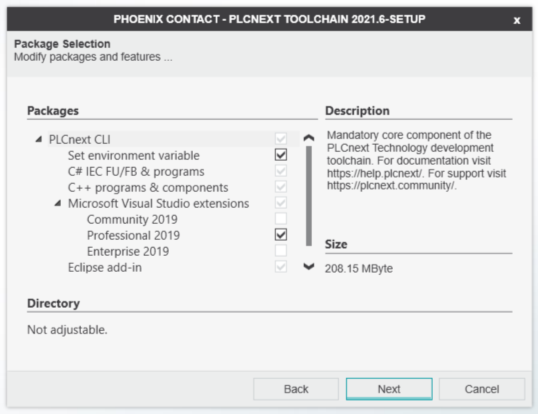
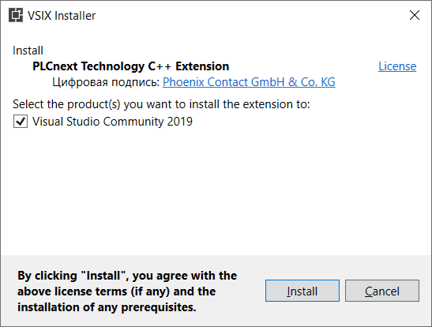

# How to configure MS Visual Studio Community® to program and crosscompile for the AXC F **x**152 controllers on Windows 10 #

> This HowTo only works for AXC F **x**152 controllers and the AXC F firmware version 2021.0 LTS. For other devices or FW versions the instructions could change from version to version.

> Based on the official [documentation](https://www.plcnext.help/te/Programming/Cpp/Cpp-programming.htm).

## 1. Installing **MS Visual Studio Community®** IDE ##

1. To install **Visual Studio Community®** visit https://visualstudio.microsoft.com/, select and download Community version.

## 2. Downloading PLCnext Technology C++ Toolchain ##

Download the latest LTS version from the Phoenix Contact website https://www.phoenixcontact.com/products (for example from the **AXC F 2152** area - http://www.phoenixcontact.com/qr/2404267/softw, current is [2021.0.3 LTS](https://www.phoenixcontact.com/online/portal/pi/pxc/product_detail_page/!ut/p/z1/3VfdjppAFH4Vb7zEGf710rLF1e1aN_6scEMGGOxs-RNG0b3qu_QFmiabNGmavgJ9ow5os6vpYhpjLyCTwAzn-85858whB2CCOTBDtCYLREkUIp_NDVOxhB4P-WuJv-1pigDvxDdityvr4qwnghkwgRknkbtyaN8FhiBBSVDUYpUiGxhy8eQTO0HJFhgxSVbFQoKXK5zSyTbGwFgmJQc5REfeSNNugDHiBJ7jJQ7yJSehPoPkn_Ofvz7lX_Kv-ff8Kf-Rf8ufGlyjO9caekPgZYFN_nDdV0nQp8xZtcIdHr5ydeEpvMHw6qsG71UwLoSRMKUodHARhb-G7DmaCWZma5zsDPexv8IUET_tUxwcpeE4sLHrBZGL9-goJUWqD7jYfII3dL_mOB-Ps8AofBQuVmhR0FQLlKS6C1RqLvAG1l2gUHeBfN0FijUXqNW9BrW616BW9xoc1_6I1v0jMy46GWMEDH12623uwIBptYNW5gQt2Io3Tmvv1HJLBVZckLI_BPKwXJpdYDpRSIvNzItANGGG7SYMEAmbcA9Mm9AnKS2B7Hn0TguZvUWx8yGM_GixtZwoiKMQhzS1nnU0oaeqHsQ25ASkQk6Cjsi1FbXDqa4nSDLEguLarFE3q3rxstUvDSp6-XGysq7eWqO5NupXR0tXJXC_JjgD0zBKAvavNN7loMyhK3ZcpLhcR3bZfnFHZvu1BU72JNFrI5WXlQ64hqc8KGd6OEEvX5R-eFl6_bLB0dVL0s96_Jn0g8qjPuDPqcvYdyrqMv7XuoyDoC3uBzedP06w_fhyeC_e74Y1HMrrg8GhQwy221A8gsnx-gj2X121tyJ8kIzBOssmXqDZ7cPbNvsNfLwWHw!!/p0/IZ7_2G101H41MGC620Q3B3AA5F3VC0=CZ6_2G101H41MGC620Q3B3AA5F3VG3=LA0=EdownloadId!7579857=action!downloadFile==/#Z7_2G101H41MGC620Q3B3AA5F3VC0)).

Navigate to the folder where downloads are located (typical path `%userprofile%/Downloads`), unzip the archive (`PLCnCLI_SDK_2021.0.3_LTS_Windows_AXC_F_2152.zip`).

## 2. Installing (updating) the PLCnext CLI ##

>The **PLCnext CLI** is a command line interface that can be used for generating metadata, C++ header files, PLCnext Engineer libraries and for the build process. The functions can be called using simple commands. An integrated help lists the commands and describes their functions.

Navigate to the folder where downloads are previously unzipped, run the installation file (`PLCnCLI_Setup_2021.0.exe`) and follow instructions of the installation wizard.



>**Phoenix Contact** recommends to add the installation directory to the **PATH** variable in the Windows® environment variables.

>To update just start the installer and make sure to install to the same directory the previous PLCnext CLI was installed in.

Check installation:

```ps
plcncli.exe --version
```

Afterwards, the check should look like this:

```ps
plcncli 21.0.0.489 (21.0.0.489)
```

## 3. Installing (updating) the Visual Studio® Extension ##

Navigate to the installation folder of the PLCnext CLI and to the .../ide-plugins/PlcNextVSExtension.vsix (default is `c:\Program Files\PHOENIX CONTACT\PLCnCLI\ide-plugins\PlcNextVSExtension.vsix`) installation file.

Execute the file and follow the Wizard's instructions; the Wizard will automatically check for required versions of Visual Studio® and modules.



>To update make sure the PLCnext CLI first (see [step 2](#2-Installing-(updating)-the-PLCnext-CLI) above) and just reinstall the Visual Studio® Extension as described at the beginning of this section. This way, the extension is updated, too.

## 3. Installing (updating) the SDK ##

Navigate to the folder where downloads are previously unzipped, Call the CLI in the console using the following command:

```ps
plcncli.exe install sdk –d [installation path] –p [path to archive file]
```

>If you install several SDKs, Phoenix Contact recommends to use the "target name/firmware version" folder structure. 

E.g.:

```ps
plcncli.exe install sdk -d C:\CLI\SDKs\AXCF2152\2021_0\ -p pxc-glibc-x86_64-mingw32-axcf2152-image-mingw-cortexa9t2hf-neon-axcf2152-toolchain-2021.0.tar.xz
```

>The SDK is specified to the controller. The full list of controllers can be found on the PHOENIX CONTACT International site ([Home > Products > PLCs and I/O systems > PLCnext Control > Product list PLCnext Technology components](https://www.phoenixcontact.com/online/portal/pi/pxc/product_list_pages/!ut/p/z1/xVRNT8MwDP0tHHqM4vQr67EMNpgEAgFj7aVKk3QLapPQZRvj15PBiQOrEJrIJR-yn-0XP-MSL3Cp2VYtmVNGs9bfizKtwikBchWTm-k4DeE-Oo_yPJlEkxnBc1zi0nIlcBGKKBMsFShLBKBYZgkapXWIkiaOmhGjJEmzgzXXzroVLqzqNwHsZB1Ax5QOwPZGbLhbB9CqtassW0p_ti3X8s1VTvKVNq1Z7ituOmu01G5dWRQSRGIEJICG0gZkDShk1CcAPPIJ0AxR0YRxAjJMRY2fj1b0RHF5vOAvf_hh5TDkX3h_-qMBjfHzVskdftKm7_wHPPyS3ysYipD-McIAfHJS-NvTwk9OS86EnhJ-PiV_hJ8NNa8fB-rl9bXMvYqNdl6WePFfMi6PJnsQ8qfBEaU-9Jvq4rK6W4zvrof6Lv4iU3W2VVy5GyNkiwvXb-ThmfHDvMTFWrKer7DtulG0V6iYbXe7x6Yb16Pv2z6Cl5jV7_nZ2Qc40tcR/?lang=en)).

## 4. Creating a new C++ project in Visual Studio ##

Now you can create a C++ project from a **PLCnext** template. Start Visual Studio, select `"Create a new project"` and search for **plcnext** in the Dialog box to show the **PLCnext** project templates and select the template that fits your needs, then click Next.

More information is located [here](https://www.plcnext.help/te/Programming/Cpp/Cpp_programming/Creating_a_Cpp_project_in_Visual_Studio.htm).