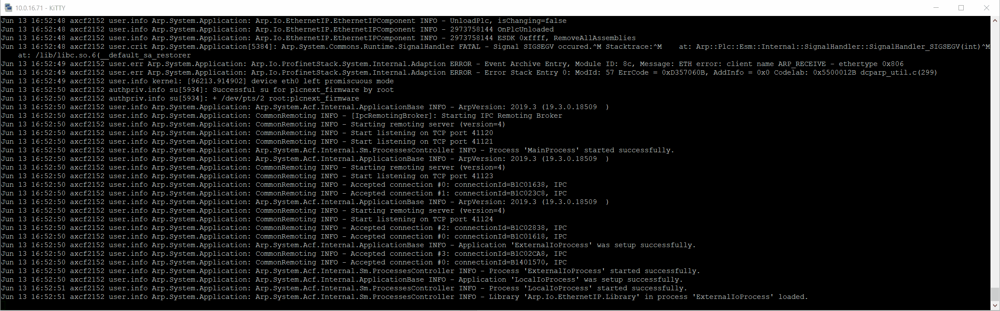
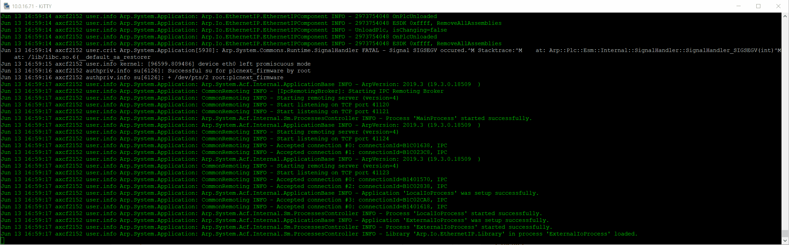

# How to logging. #
## 1. **PLCnext** diagnostic log file. ##

PLCnext log file is located here: *"/opt/plcnext/logs/Output.log"*. To view the file content use this command:

```sh
cat /opt/plcnext/logs/Output.log
```

To constantly monitor the file content use this:

```sh
tail -F /opt/plcnext/logs/Output.log
```



The parameter **-F** is important - it makes possible to see changes after file recreation (because of log rotation).

Next example makes it easier to catch error messages by using colors:

```sh
tail -F /var/log/messages | awk '
  /INFO/ {print "\033[32m" $0 "\033[39m"; next}
  /WARN/ {print "\033[33m" $0 "\033[39m"; next}
  /ERROR/ {print "\033[31m" $0 "\033[39m"; next}
  1 {print}
  '
```



## 2. System diagnostic log file. ##

System log file is located here: *"/var/log/messages"*. You can view this file content to monitor system wide events.  
If it is required to find some certain events - it is possible to use *grep*:

```sh
tail -F /var/log/messages | grep Arp.System
```

## 3. Using **syslog**. ##

You can also use **syslog** and save messages to system diagnostic log file:

```cpp
#include <syslog.h>
//...
openlog ("my_prog", LOG_CONS | LOG_PID | LOG_NDELAY, LOG_USER);

syslog (LOG_NOTICE, "Program started by User %d", getuid ());
syslog (LOG_INFO, "Test info message.");

closelog ();
//...
```