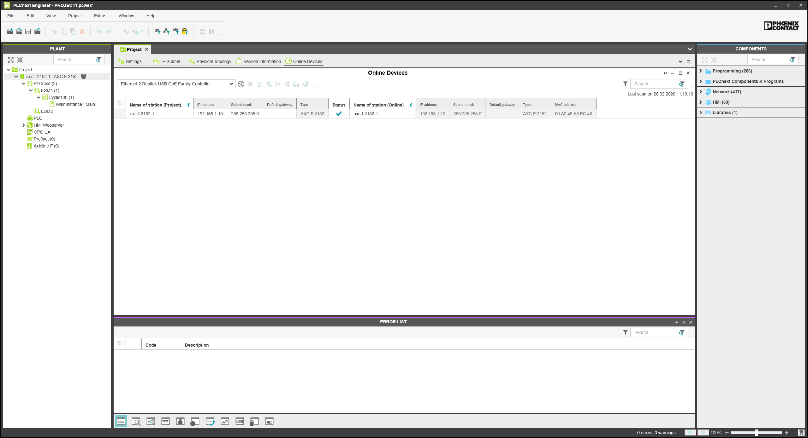

# Quick start **AXC F 2152** and **PLCnext Engineer** #

## Content ##
1. [Connecting the controller](#Connecting-the-controller)  
2. [Updating the controller firmware](#Updating-the-controller-firmware)  
3. [PLCnext Engineer project creation](#PLCnext-Engineer-project-creation)  
4. [PLCnext Engineer project setup](#PLCnext-Engineer-project-setup)  
4.1 [General project setup](#General-project-setup)  
4.2 [Controller network settings setup](#Controller-network-settings-setup)  
4.3 [Connecting to the controller](#Connecting-to-the-controller)  
4.4 [Password changing](#Password-changing)  


## Connecting the controller ##
Connect the controller using an USB ethernet hub:

<p align="center">  </p>
<p align="center"> Figure 1. USB ethernet hub</p>

Using browser open default controller address [https://192.168.1.10](https://192.168.1.10):

<p align="center">  </p>
<p align="center"> Figure 2. Welcome screen</p>

## Updating the controller firmware ##

The firmware latest release is located [here](https://www.phoenixcontact.com/online/portal/us/pxc/product_detail_page/!ut/p/z1/3Vdbk5owFP4r7oOPMReudqYPinbVVdet2BVeGAiBTQuEBXQvv75hddtdp9WHHWdamMyQhHO-c85HvhCgC9fQzfwtj_2Ki8xP5Nhxdc_u28Phguj4-kbro_FAs4ZT9SsezQn8Bl3oVn4AHVz3Eh4UfvEEnU3Jsnoi5yF0iIpUohv1WEQLy7qCzgIQDLAK0ItbxauEQccSWVWIJGFFC7R6a6v1pUWwRuTgFeH2aD49CXY83Z0_-svVQ6f8HelveCa5skaXKp6ZwylBN7OZbfcn6mBqE7j8Iwu_CSoYZXzLColUs1OIcEOrAat8npTjiqXj93Qd0peHUSpCtvcWJa_f0zssObbZY7Wfo_THIdcSIvGzeOPHNcyJgnDTClIaVpCCmlZQ0zSkNE1DStM0NGmahiZN09CkcUuuaZtCX_3vCpITm4JDJ3-kQFDAZQrhSzafZOjPr5En0OVB2nmgaQd1pGlnH8zb2Xp5DXbbh44e343GsTxhukcPkT28NzhyCF2yzFstvcXaWi1P8N5V4e2Wswe4ykSRyhP7cld8TR7WWeRjwgALCQKqgTHwUVcFpsaCAFE_MuW3aYRORdA_GOEEvHZW-MV54bXzkqMZZ4WffjT7ydGlPlXr_0f-_f7e7UGXyp-7Wp3remdoowcWtFHqc9ndK6pso4SX1YuiZD9PaCbtvYrRu0wkIn7yqEhzkbGsKr38l7DbKDKMCLEAAeIbMlVEFWDqRhcYYURUDTGihwHM09RU6gZW62ebBc9vmomU_cNd8-Zzbfu2_YMOc-B2x-DSCszZUNHi1Du4lb2Li58JGvCS/?uri=pxc-iframe-integration:firmwaredownload&prodid=2404267).

To update the controller firmware, proceed as follows:

- Download the *.zip firmware file with version **2020.0.1 LTS** at Phoenix Contact [site](https://select.phoenixcontact.com/phoenix/dwl/dwl13a.jsp?fct=dwl&asid=7449344&name=AXC_F_2152_FW2020_0_1_LTS.zip&prodid=2404267&lang=en&hwv=&debug=0).

- Unzip the *.zip firmware file.

- Run the *.exe setup file.

- Follow the instructions of the installation wizard.

When installing, the update file (*.raucb) and PDF files with device-specific information will be copied to the selected destination directory.

- Open your browser, then go to web-based management (WBM) page [https://192.168.1.10/wbm](https://192.168.1.10/wbm):

<p align="center">  </p>
<p align="center"> Figure 3. Login screen</p>

- Log in as an administrator.

The following access data is set by default:
```
User name: admin
Password: Printed on the controller (see Figure 4).
```
The following access data is set by default:

<p align="center">  </p>
<p align="center"> Figure 4. Password location </p>

- To start the firmware update, go to **`"Administration"`** - **`"Firmware update"`**:

<p align="center">  </p>
<p align="center"> Figure 5. Firmware update</p>

You have to select the update file. Default location is:
```
c:\Users\Public\Documents\PLCnext\Firmware\FW2020_0_1_LTS\axcf2152-bundle-base-axcf2152.raucb
```
Update is ready to be installed:

<p align="center">  </p>
<p align="center"> Figure 6. Firmware update</p>

Start update by pressing **`"Start Update"`** button. The firmware will be updated and the web page shows updating process. During the firmware update, the RUN LED begins to flash, and then stops.
Following this, the controller is restarted. Once the controller has been fully initialized, the RUN LED lights up permanently.

## PLCnext Engineer project creation ##

It's important to use the appropriate version of **`"PLCnext Engineer"`** - **`"2020.0.1"`**.  Start **`"PLCnext Engineer"`** and select **`"Empty AXC F 2152 v00 / 2020.0.0 project"`**:

<p align="center">  </p>
<p align="center"> Figure 7. Creating new project</p>

The default project wil be created.

## PLCnext Engineer project setup ##

### General project setup ###

Open project properties (double click on the tree element **`"Project"`**) - here we can see default general network settings (controller and bus couplers):

<p align="center">  </p>
<p align="center"> Figure 8. Projects network settings</p>

Here we change settings to the required values.

On the page **`"IP Subnet"`** controller network settings are shown:

<p align="center">  </p>
<p align="center"> Figure 9. Controller IP settings</p>

### Controller network settings setup ###

Open page **`"Online Devices"`**, select the required network from the drop-down list and click the **`"Scan the network"`** button. After the scanning process the discovered controller should be listed:

<p align="center">  </p>
<p align="center"> Figure 10. Controller search</p>

Set the discovered controller as project controller:

<p align="center">  </p>
<p align="center"> Figure 11. Setting the controller</p>

The discovered controller will be added to the project and configured, after a while it should be displayed with the new settings:

<p align="center">  </p>
<p align="center"> Figure 12. Controllers</p>

### Connecting to the controller ###

Open page with a controller settings and click the connect button:

<p align="center">  </p>
<p align="center"> Figure 13. Connecting to the controller</p>

After successful authorization we get current controller state info:

<p align="center">  </p>
<p align="center"> Figure 14. Controller info</p>

### Password changing ###

It is strongly recommended to change admin user password:

<p align="center">  </p>
<p align="center"> Figure 15. Password changing</p>
